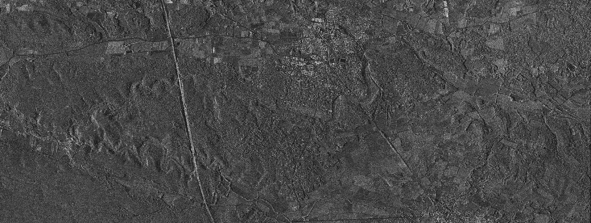
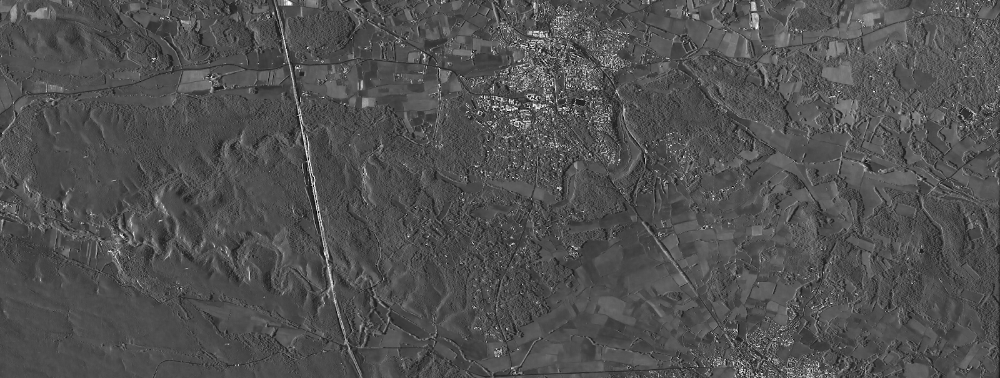

# deepdespeckling Synthetic Aperture Radar (SAR) images with Pytorch

Speckle fluctuations seriously limit the interpretability of synthetic aperture radar (SAR) images. This package provides despeckling methods that can highly improve the quality and interpretability of SAR images. Both Stripmap and Spotlight operations are handled by this package. 
 
The package contains both test and train parts, wether you wish to despeckle a single pic (test) or use our model to build or improve your own.

To get a test function using Tensorflow's framework : https://gitlab.telecom-paris.fr/ring/MERLIN/-/blob/master/README.md

[](https://badge.fury.io/py/deepdespeckling)
[](https://opensource.org/licenses/MIT)

# Installation

Install deepdespeckling by running in the command prompt :

```python
pip install deepdespeckling
```

# Authors


* [Emanuele Dalsasso](https://perso.telecom-paristech.fr/dalsasso/) (Researcher at Telecom Paris)
* [Youcef Kemiche](https://www.linkedin.com/in/youcef-kemiche-3095b9174/) (Hi! PARIS Machine Learning Research Engineer)
* [Pierre Blanchard](https://www.linkedin.com/in/pierre-blanchard-28245462/) (Hi! PARIS Engineer)


# Use cases

### Test
The package offers you 3 different methods for despeckling your SAR images: the fullsize method, the coordinates based method and the crop method.

1) I have a high-resolution SAR image and I want to apply the despeckling function to the whole of it:

```python
from deepdespeckling.merlin.test.spotlight import despeckle_st

image_path="path/to/cosar/image"
destination_directory="path/where/to/save/results"
model_weights_path="path/to/model/weights"

despeckle_st(image_path,destination_directory,model_weights_path=model_weights_path)
```
Noisy image             |  Denoised image
:----------------------:|:-------------------------:
  |  

2) I have a high-resolution SAR image but I only want to apply the despeckling function to a specific area for which I know the coordinates:
```python
from deepdespeckling.merlin.test.spotlight import despeckle_from_coordinates_st

image_path="path/to/cosar/image"
destination_directory="path/where/to/save/results"
model_weights_path="path/to/model/weights"
coordinates_dictionnary = {'x_start':2600,'y_start':1000,'x_end':3000,'y_end':1200}

despeckle_from_coordinates_st(image_path, coordinates_dict, destination_directory, model_weights_path)
````

Noisy image             |  Denoised image
:----------------------:|:-------------------------:
  |  

3) I have a high-resolution SAR image but I want to apply the despeckling function to an area I want to select with a crop:
```python
from deepdespeckling.merlin.test.spotlight import despeckle_from_crop_st

image_path="path/to/cosar/image"
destination_directory="path/where/to/save/results"
model_weights_path="path/to/model/weights"
fixed = True "(it will crop a 256*256 image from the position of your click)" or False "(you will draw free-handly the area of your interest)"

despeckle_from_crop_st(image_path, destination_directory, model_weights_path, fixed=False)
```

* The cropping tool: Just select an area and press "q" when you are satisfied with the crop !

<p align="center">
  
</p>

* The results:

Noisy cropped image                     |           Denoised cropped image
:-----------------------------------------------------------:|:------------------------------------------:
  | 

you can use the same features for stripmap images by importing : 
```python
from deepdespeckling.merlin.test.stripmap import despeckle_from_crop_sp,despeckle_sp,despeckle_from_coordinates_sp
```
### Train

1) I want to train my own model from scratch:
```python
from deepdespeckling.merlin.train.train import create_model, fit_model
nb_epoch=1

# schedule the learning rate
lr = 0.001 * np.ones([nb_epoch])
lr[6:20] = lr[0]/10
lr[20:] = lr[0]/100
seed=1

training_set_directory="path/to/the/training/data"
validation_set_directory="path/to/the/test/data"
save_directory="path/where/to/save/results"
sample_directory="path/to/sample/data"
from_pretrained=False

model=create_model(batch_size=12,val_batch_size=1,device=torch.device("cuda:0" if torch.cuda.is_available() else "cpu"),from_pretrained=from_pretrained)
fit_model(model,lr,nb_epoch,training_set_directory,validation_set_directory,sample_directory,save_directory,seed=2)

```

2) I want to train a model using the pre-trained version :
```python
from deepdespeckling.merlin.train.train import create_model, fit_model
from merlinsar.train.model import Model

nb_epoch=1

# schedule the learning rate
lr = 0.001 * np.ones([nb_epoch])
lr[6:20] = lr[0]/10
lr[20:] = lr[0]/100

training_set_directory="path/to/the/training/data"
validation_set_directory="path/to/the/test/data"
save_directory="path/where/to/save/results"
sample_directory="path/to/sample/data"
from_pretrained=True

model=create_model(Model,batch_size=12,val_batch_size=1,device=torch.device("cuda:0" if torch.cuda.is_available() else "cpu"),from_pretrained=from_pretrained)
fit_model(model,lr,nb_epoch,training_set_directory,validation_set_directory,sample_directory,save_directory,seed=2)
```

# Contribute


- Source Code: https://github.com/hi-paris/deepdespeckling.git

# License

* Free software: MIT

# FAQ

* Please contact us at [engineer@hi-paris.fr](engineer@hi-paris.fr)

# References

[1] DALSASSO, Emanuele, DENIS, Loïc, et TUPIN, Florence. [As if by magic: self-supervised training of deep despeckling networks with MERLIN](https://arxiv.org/pdf/2110.13148.pdf). IEEE Transactions on Geoscience and Remote Sensing, 2021, vol. 60, p. 1-13.
